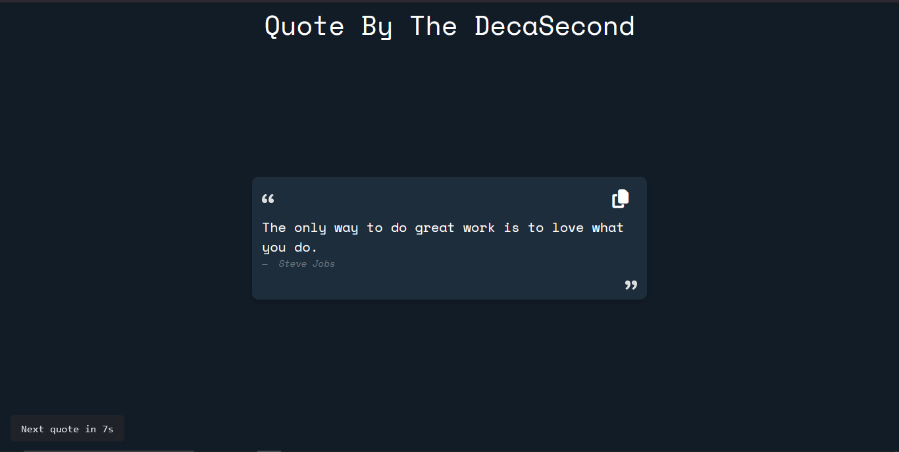

# Quotes By The DecaSecond



# Deploy Link

https://pr-quotes-app-js.vercel.app/

A simple web app that displays inspirational quotes, changing every 10 seconds. Users can copy the current quote to their clipboard with a single click and receive a toast notification. A countdown timer in the bottom left corner shows when the next quote will appear.

## Features

- **Auto-Rotating Quotes:** A new quote appears every 10 seconds.
- **Copy to Clipboard:** Click the copy button to copy the current quote and author.
- **Toast Notification:** A popup confirms when a quote is copied.
- **Countdown Timer:** See how many seconds remain until the next quote.
- **Responsive Design:** Built with Bootstrap 5 for a clean, modern look.

## Usage

1. **Clone or Download** this repository.
2. Open `index.html` in your browser.
3. Enjoy the rotating quotes!
4. Click the copy button (clipboard icon) to copy the current quote.

## Project Structure

```
.
├── index.html
├── style.css
├── script.js
├── icons/
│   ├── Daco_1982805.png
│   └── invert.png
```

## Dependencies

- [Bootstrap 5](https://getbootstrap.com/)
- [Font Awesome 6](https://fontawesome.com/)
- [Google Fonts: Space Mono](https://fonts.google.com/specimen/Space+Mono)

## Screenshots

 <!-- Add a screenshot if available -->

## License

This project is for educational and personal use.